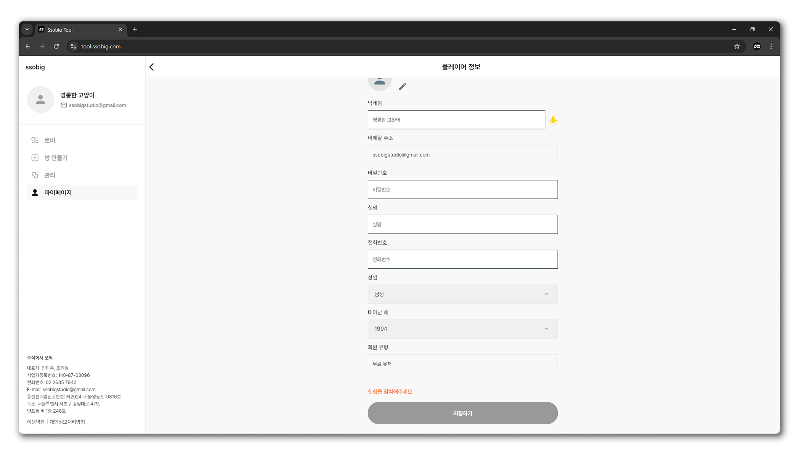

# 로그인 및 계정설정

## 로그인 방법

1. [https://tool.ssobig.com](https://tool.ssobig.com/minified:EL) 링크에 접속합니다.

<figure><figcaption></figcaption></figure>

2. 상단 좌측 로그인 탭에서 \[카카로 로그인] 혹은 \[구글 로그인]으로 로그인 해주세요

<figure><figcaption></figcaption></figure>

3. 처음 접속하시면 기본 정보를 입력해야 로그인이 완료됩니다.

## 개인정보 수정

1. \[마이페이지]를 클릭합니다.
2. 스크롤을 내려 \[개인정보 수정]을 클릭합니다.

<figure><figcaption></figcaption></figure>

3. 원하는 사항을 변경 후 \[저장하기]를 눌러 저장합니다.

<figure><figcaption></figcaption></figure>

