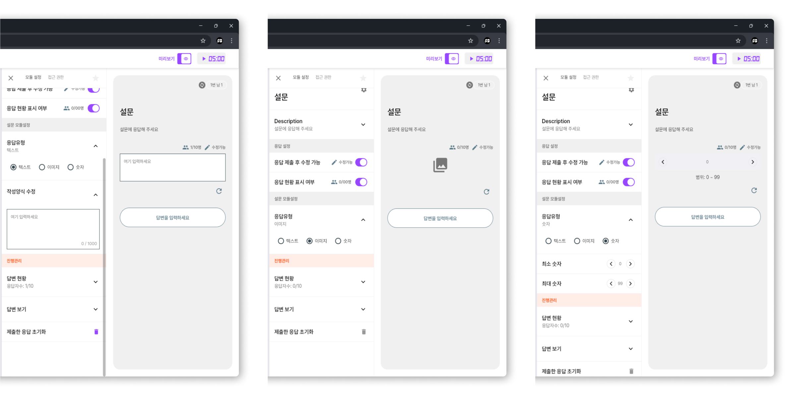
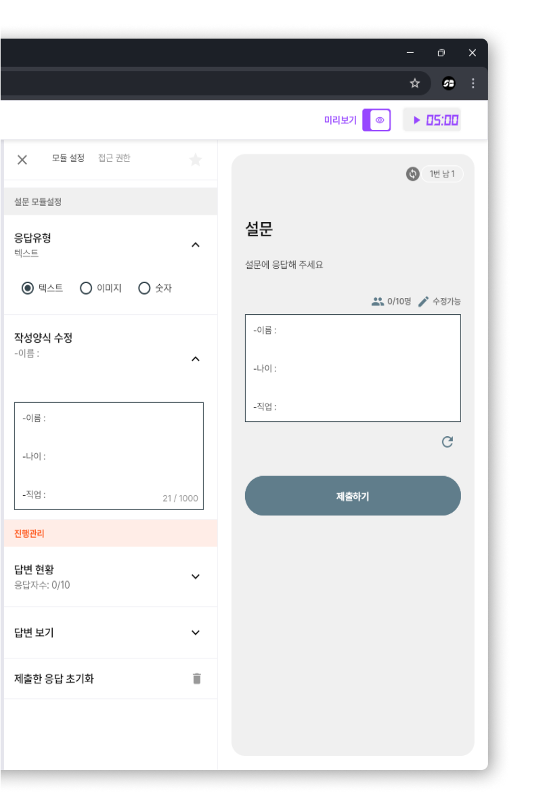

# 설문

> **SSOBIG TOOL 설문 모듈이란?**
>
> **설문 모듈**은 SSOBIG 툴에서 제공하는 **독립적인 구성 요소**로, 플레이어들이 **다양한 형식(텍스트, 숫자, 이미지 등)으로 응답**을 제출할 수 있도록 하여, **실시간으로 데이터를 수집**하고 **결과를 시각화**할 수 있게 해주는 **상호작용 기능**입니다. 이를 통해 **피드백 수집**, **인사이트 도출**, **단계별 의사결정** 등 폭넓은 활용이 가능합니다.

<figure><figcaption></figcaption></figure>

## 핵심 기능

*   **다양한 응답 형식:**

    텍스트, 숫자, 이미지 등 여러 유형의 질문을 구성할 수 있어, 보다 풍부한 응답 데이터를 수집할 수 있습니다.
*   **실시간 데이터 집계 및 시각화:**

    플레이어들이 제출한 응답을 즉시 확인하고, 원하는 응답 양식에 따라 데이터를 받아 빠르게 정보를 시각화・공유할 수 있습니다.

***

## 설문 모듈 설정

### 응답 설정

* 자세한 응답 설정 방법은 [응답 설정](../undefined/undefined.md) 페이지를 참조하세요.

### 응답 유형

* **텍스트 응답**
  * 플레이어가 자유롭게 텍스트를 입력할 수 있는 형식으로, 의견이나 설명을 상세하게 받을 때 유용합니다.
* **숫자 응답**
  * 정량적 값을 입력받을 수 있는 형식으로, 인원 수나 점수 같은 데이터를 수집하기 적합합니다.
* **이미지 응답**
  * 플레이어가 이미지를 업로드하여 답변할 수 있는 형식으로, 시각적인 자료를 수집하거나 사진 기반의 답변이 필요한 경우 사용합니다.

<figure><figcaption></figcaption></figure>

#### 텍스트작성 양식 수정

* 텍스트 응답을 받을 때, 플레이어가 입력할 **응답 형식**(예: 단일 줄, 여러 줄 등)을 세부적으로 설정할 수 있습니다.
* 이를 통해 원하는 방식으로 답변을 수집하거나, 특정 형식을 요구할 수 있어, 보다 명확하고 일관된 데이터를 얻을 수 있습니다.

<figure><figcaption></figcaption></figure>

### 현황 

* 현재 투표의 응답 현황(누가 응답했는지, 누가 응답하지 않았는지 등)은 [현황](broken-reference) 페이지에서 확인할 수 있습니다.

### 답변 보기 

* 각 플레이어가 제출한 답변의 상세 내역은 [답변 보기](broken-reference) 페이지에서 확인할 수 있습니다.

### 제출한 응답 초기화 

* 플레이어들이 제출한 응답을 초기화하는 방법은 [응답 초기화](broken-reference) 페이지를 참조하세요.
