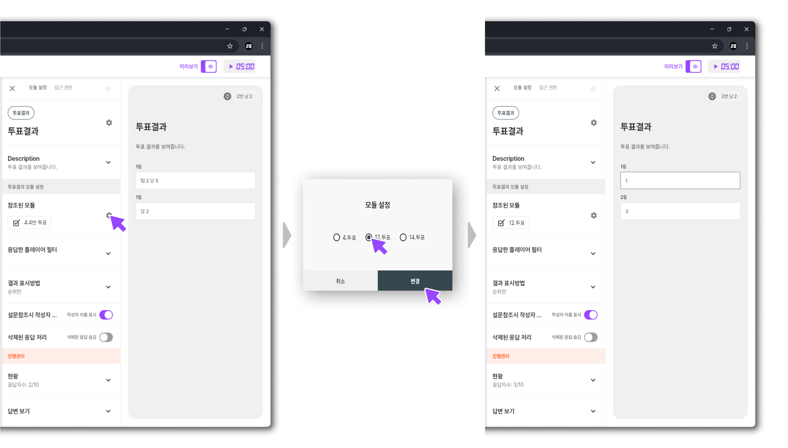
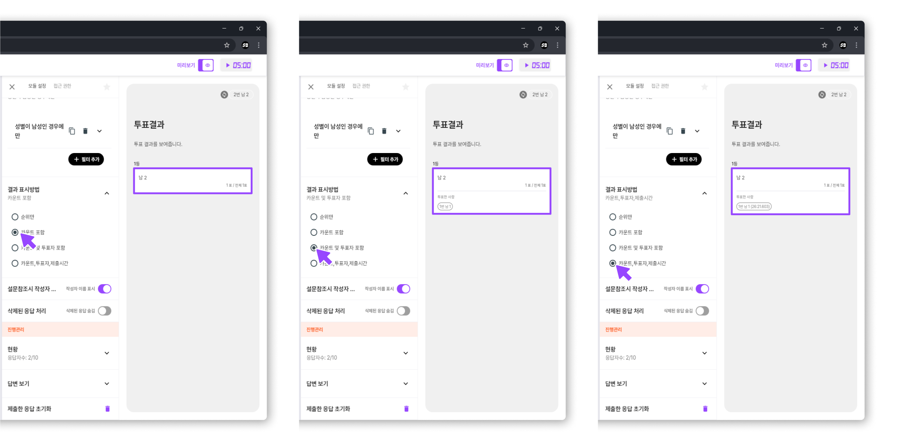
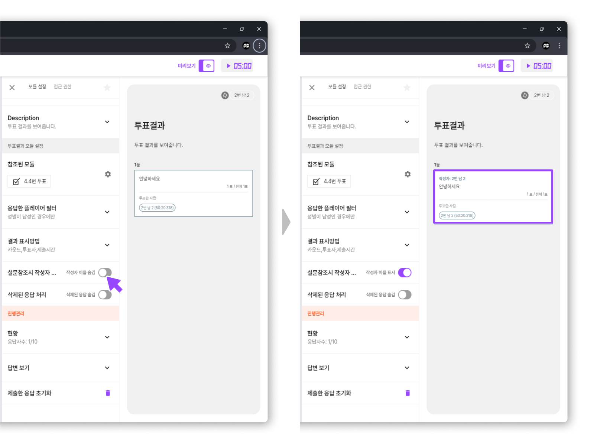
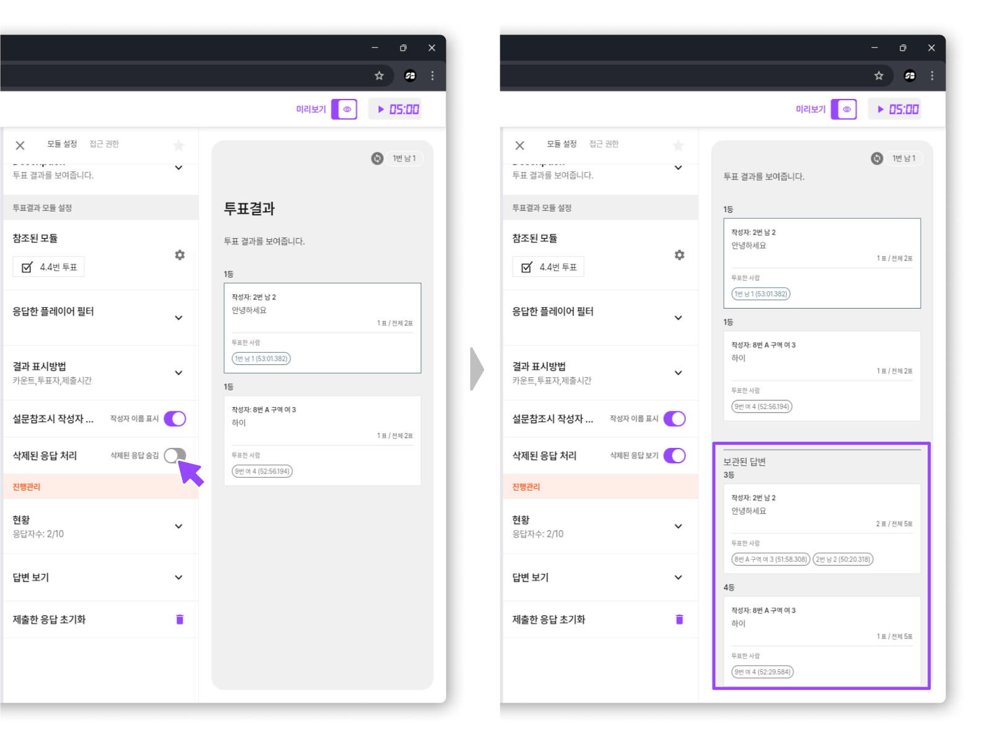
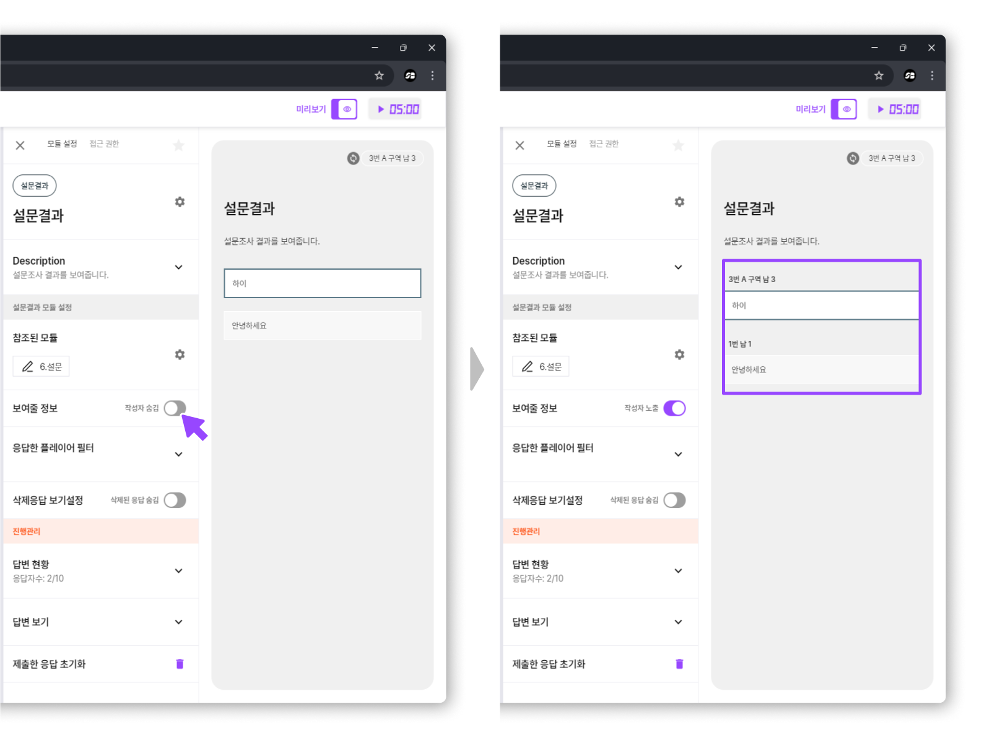

# 결과

> **SSOBIG TOOL 결과 모듈이란?**
>
> **결과 모듈**은 SSOBIG 툴에서 진행된 **투표, 설문, 매칭, 가중치 모듈 등** 다양한 상호작용의 **최종 데이터를 집계・분석・시각화**하는 독립적인 구성 요소입니다.
>
> 이를 통해 **행사 중간**이나 **종료 후**에 다양한 투표 결과를 한눈에 확인하고,
>
> 필요 시 **보고서 작성**이나 **후속 액션**(예: 자원 분배, 팀 이동 등)을 간편하게 이어갈 수 있습니다.

## **핵심 기능**

* **투표/설문/매칭/가치관/밸런스의 결과를 참가자들이** **확인**할 수 있습니다.
  * 결과 모듈은 **투표/설문/매칭/가치관/밸런스** 모듈을 생성시 각 해당 모듈의 맞는 결과 모듈이 생성 됩니다.
* 결과 데이터를 **실시간 집계** 혹은 **행사 종료 후**에 한눈에 보기 좋게 정리·시각화합니다.
* **필터**를 통해 원하는 시점, 특정 조건(예: 팀/역할)만 골라서 결과를 분석할 수 있습니다.

***

## 각 결과 모듈 설정

### 투표 결과

#### 참조된 모듈

* **연결할 모듈 선택**
  * 해당 결과 모듈에서 표시할 모듈을 지정합니다.
  * 투표 리스트에서 “투표 A, B, C” 중 어떤 것을 불러올지 선택하면, 그 투표의 최종 결과가 표시됩니다.

<figure><figcaption></figcaption></figure>

#### 응답한 플레이어 필터

* **누가 응답했는지 필터링**
  * 특정 팀, 역할, 구역 등 유형,대상,조건을 적용해 “어떤 플레이어들의 응답만 볼지”를 결정할 수 있습니다.
  * 예) 팀1의 응답만 보기, 성별=여성만 보기 등.

<figure><figcaption></figcaption></figure>

#### 투표 결과 표시방법

* **순위만**
  * 투표 항목의 **순위**만 표시합니다.
  * 예: 1위, 2위, 3위 등.
* **카운트 포함**
  * 각 투표 항목에 대해 **몇 명이 투표**했는지의 \*\*숫자(카운트)\*\*를 함께 표시합니다.
* **카운트 및 투표자 포함**
  * 투표 수(카운트)뿐만 아니라, **누가 투표**했는지 플레이어 명단도 함께 보여줍니다.
* **카운트, 투표자, 제출시간**
  * 투표 수와 투표자 정보 외에도, 각 플레이어가 \*\*투표를 제출한 시간(초 단위)\*\*까지 확인할 수 있습니다.

<figure><figcaption></figcaption></figure>

#### 설문 참조시 작성자 이름 표시

* **투표가 이전 설문결과를 불러오는 경우**
  * “이전 설문에서 응답자 이름(혹은 닉네임)을 함께 표시”할지 결정합니다.익명성이 필요한 상황이라면 **비표시**가 적절합니다.

<figure><figcaption></figcaption></figure>

#### 삭제된 응답 처리

* **보관된 답변**
  * 사용자가가 잘못된/중복된 응답을 삭제한 경우, 결과 화면에 반영되지 않습니다. 하지만 삭제된 응답을 보기 할 경우 보관된 답변으로 삭제된 답변이 플레이어 화면에 뜨게 됩니다.

<figure><figcaption></figcaption></figure>

### 설문 결과

#### [참조된 모듈](undefined-6.md#undefined-2),[응답한 플레이어 필터](undefined-6.md#undefined-3),[삭제 응답 보기 설정](undefined-6.md#undefined-6) (투표 결과 참조)

#### 보여줄 정보

* 작성자 노출
  * 설문 결과를 표시할 때, 각 응답의 작성자 정보를 함께 공개할지 여부를 결정합니다.

<figure><figcaption></figcaption></figure>

### 매칭 결과

#### [참조된 모듈](undefined-6.md#undefined-3) (투표 결과 참조)

#### 결과 표시 방법

* 매칭 결과를 표시하는 방법을 선택할 수 있습니다.
  * 매칭된 케이스만 보여주기
  * 매칭 안된 케이스도 보여주기
    * 내가 선택하지 않아도 나를 선택한 사람을 확인 할 수 있습니다.

<figure><figcaption></figcaption></figure>

### 가중치,밸런스 결과

#### [참조된 모듈](undefined-6.md#undefined-2),[응답한 플레이어 필터](undefined-6.md#undefined-3) (투표 결과 참조)

#### 결과 표시 방법

가중치 모듈의 결과는 다음 네 가지 방식으로 시각화할 수 있습니다.

*   **원형차트:**

    전체 점수 분포를 원형 그래프로 표시하여, 각 항목이 차지하는 비율을 한눈에 파악할 수 있습니다.
*   **바차트 – 개인별:**

    각 플레이어가 배분한 점수를 개별적으로 바 차트로 나타내어, 개인별 점수 분포 및 기여도를 비교할 수 있습니다.
*   **바차트 – 특성별:**

    보기에 따른 점수 분포를 바 차트로 표시하여, 보기 간의 차이를 쉽게 확인할 수 있습니다.
*   **2차원 차트:**

    두 가지 응답을 동시에 시각화하여, 면 중 한 곳에 표현 됩니다.

<figure><figcaption></figcaption></figure>
