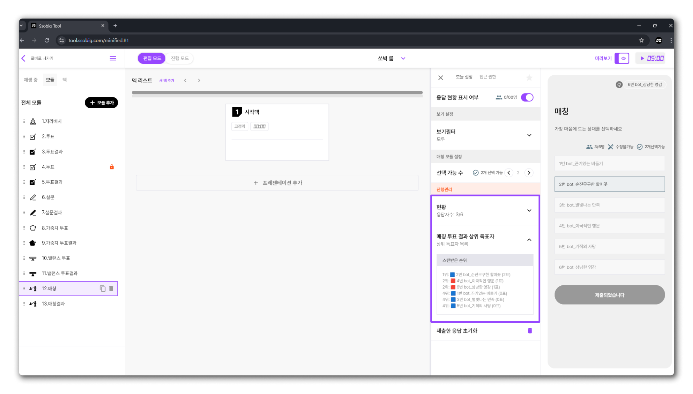

# 매칭

> **SSOBIG TOOL 매칭 투표 모듈이란?**
>
> **매칭 투표 모듈**은 SSOBIG 툴에서 제공하는 **독립적인 구성 요소** 중 하나로,
>
> 플레이어들이 **서로를 선택**(호감 표시)하고, **상호 매칭**이 성사되는 과정을 자동 집계하고 결과를 플레이어들에게 보여주는 **상호작용 기능**입니다.
>
> 이를 통해 연애/소개팅 모임에서의 **호감 매칭**, 네트워킹 행사에서의 **파트너 매칭** 등을 간편히 운영할 수 있습니다.

## **핵심 기능**

*   **상호 선택을 기반으로 한 매칭**

    플레이어들이 서로를 **호감 선택**(지목)하거나, 특정 조건(팀/성별/역할 등)에 맞춰 매칭 투표를 진행해, 최종적으로 **양방향 매칭** 또는 **조건 충족 매칭**을 형성할 수 있습니다.
* **다양한 매칭 방식**
  1. **다중 매칭**(플레이어가 복수인원을 동시에 지목 가능)
  2. **조건 매칭**(예: 이성만 선택 가능, 같은 팀원만 선택 가능)

***

## 매칭 설정 가이드

### 응답 설정

* 자세한 응답 설정 방법은 [응답  설정](../undefined/undefined.md) 페이지를 참조하세요.

### 보기 필터

* 자세한 필터 설정 방법과 예시는 [필터 시스템](../../undefined-2/undefined-4.md) 페이지에서 확인하실 수 있습니다.

### 선택 가능 수

* **플레이어들의 선택 가능 수**를 설정하여, 한 번의 투표에서 플레이어가 선택할 수 있는 옵션의 개수를 지정할 수 있습니다.
* 1개 이상의 옵션 선택이 가능하며, 여러 선택지를 동시에 투표 받을 때 유용하게 활용할 수 있습니다.
* 단, 플레이어들은 설정된 선택 가능 수 이하로 투표할 수 있습니다.

<figure><figcaption></figcaption></figure>

### 현황

* 현재 투표의 응답 현황(누가 응답했는지, 누가 응답하지 않았는지 등)은 [현황](../undefined/undefined-2.md) 페이지에서 확인할 수 있습니다.

### 매칭 투표 결과 상위 득표자

* 플레이어가 얼마나 득표를 했는지 확인 할 수 있습니다.

<figure><figcaption></figcaption></figure>

### 제출한 응답 초기화

* 플레이어들이 제출한 응답을 초기화하는 방법은 [응답 초기화](../undefined/undefined-4.md) 페이지를 참조하세요.

***

