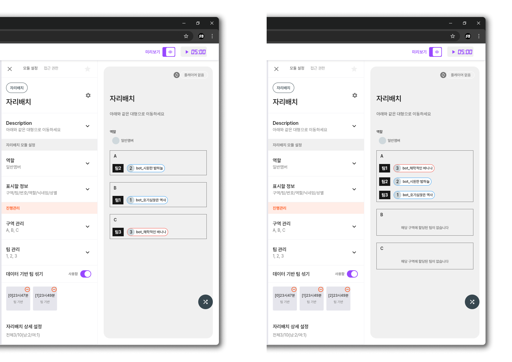
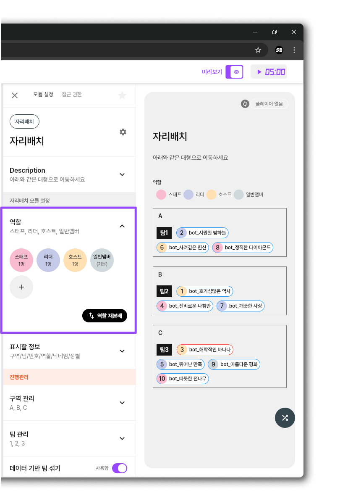
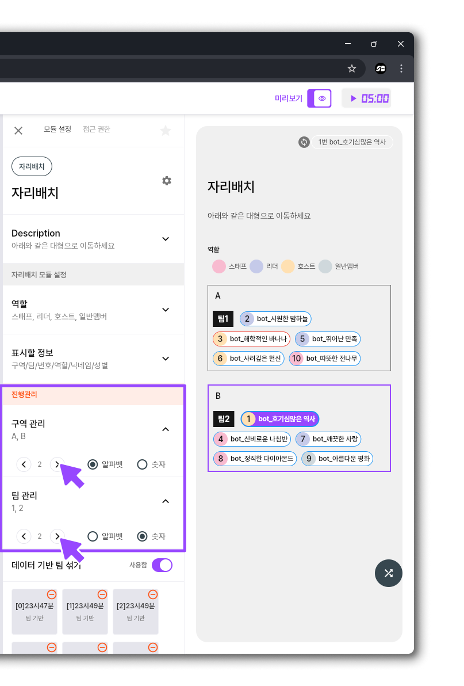
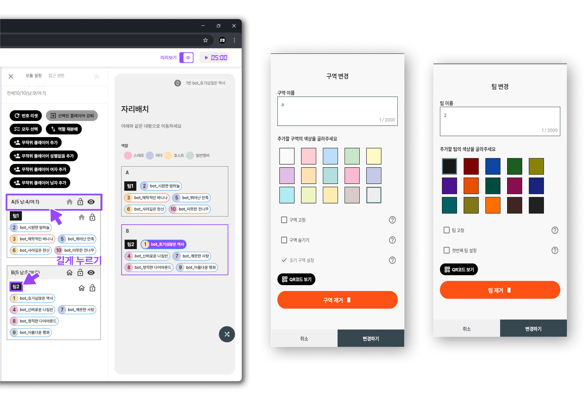
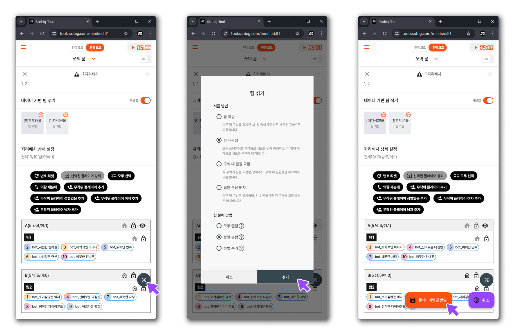
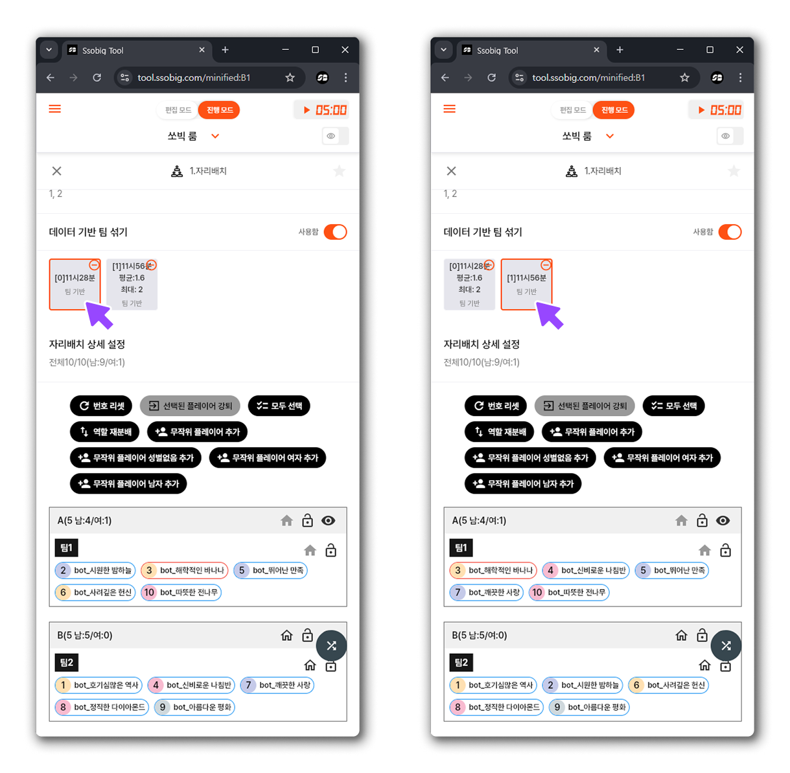
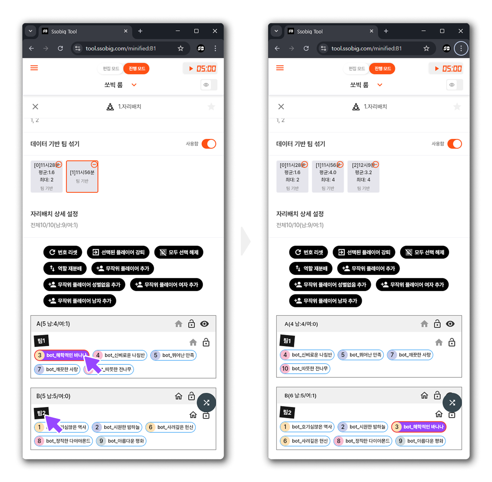

# 자리배치 모듈

## 핵심 기능

* **구역/팀/역할 설정**: 참가자들을 특정 구역이나 팀으로 배분할 수 있고 참가자마다 다른 역할을 부여 할 수 있다.
* **자동 및 수동 배치**: 사전 규칙에 따른 자동 배치와 개별 조정을 위한 수동 배치 기능

***

## 구역,팀 설명

### **구역 (Zone)**

* 구역은 **장소**나 **영역**과 같은 개념입니다.
* 이는 소통 콘텐츠내에서 참가자들이 모이는 넓은 물리적 또는 가상 공간을 의미하며, 여러 구역으로 나누어 활동할 수 있습니다.
* 예를 들어, A구역, B구역,C구역 등으로 나누어 참가자들이 특정 영역에서만 활동하도록 구성할 수 있습니다.

<figure><figcaption></figcaption></figure>

### **팀 (Team)**

* 팀은 참가자들의 **상태**나 **그룹 속성**을 나타내는 개념입니다.
* 이는 각 참가자가 어떤 그룹에 속해 있는지를 나타내며, 같은 구역 내에서도 여러 팀이 존재할 수 있습니다.
* 예를 들어, 같은 A구역 내에 서로 다른 팀으로 분류되어 있거나, 같은 팀의 구성원이 여러 구역에 흩어져 있을 수도 있습니다.

<figure><figcaption></figcaption></figure>

### **역할 (**&#x52;ol&#x65;**)**

* 역할은 참가자의 **개인 속성**을 나타내는 개념입니다.
* 개인 속성으로 \[접근 권한],\[보기 필터] 를 걸어 다양한 인터랙션이 가능합니다.
* 참가자는 하나의 역할만 부여 받을 수 있습니다.

<figure><figcaption></figcaption></figure>

> 요약
>
> * **구역**은 넓은 의미의 **장소**를 나타내며, 모임의 물리적 또는 가상 공간의 분할 단위입니다.
> * **팀**은 참가자들의 **상태**나 **그룹 속성**을 나타내며, 같은 구역 내에서도 여러 팀으로 구분될 수 있고, 한 팀의 구성원이 여러 구역에 걸쳐 있을 수도 있습니다.
> * **역할**은 참가자의 **개인 속성**을 나타내며, 이를 통해 개별 \[접근 권한]과 \[보기 필터]를 적용하여 맞춤형 인터랙션을 구현할 수 있습니다.

이와 같이 구역, 팀, 역할은 모두 참가자들의 상태를 나타내지만, 구역은 **더 넓은 영역**을, 팀은 **세부 그룹 또는 상태**를, 그리고 역할은 각 참가자의 **개별 속성**을 표현하는 요소라고 볼 수 있습니다.타내지만, 구역은 **더 넓은 영역**을, 팀은 **세부 그룹** 또는 **상태**를 표현한다고 볼 수 있습니다.

***

## 주요 기능 및 사용 방법

### 구역 및 팀 설정

* **구역 및 팀 생성**:
  * 구역과 팀을 원하는 만큼 만들 수 있습니다.
  * 자리배치 모듈 진행관리에서 구역 관리, 팀 관리 토글을 클릭세요
  * 원하는 구역, 팀의 숫자만큼 화살표를 클릭하세요.
  * 구역,팀의 이름을 알파벳 또는 숫자로 만들 수 있습니다.

<figure><figcaption></figcaption></figure>

* **구역 및 팀 상세 설정 :**
  * **설정 접근 방법**
    * 구역 영역 또는 팀 영역을 길게 누르면 설정 창이 열립니다.
  * **상세 설정 내용**
    * **이름 및 색상 변경**:
      * 구역 또는 팀의 이름과 색상을 원하는 대로 수정할 수 있습니다.
    * **제거 기능**:
      * 불필요한 구역이나 팀은 설정 창에서 제거할 수 있습니다.
      * 단, 한 번 제거 후 **\[변경사항 반영]** 버튼을 눌러 저장하면, 해당 항목은 복구되지 않습니다.
    * **고정 및 숨기기 기능**:
      * **고정**:
        * 자리 섞기 기능을 실행할 때, 고정된 구역이나 팀은 참가자 배치에서 변경되지 않습니다.
        * 고정된 구역이나 팀에 속한 참가자들은 다른 그룹과 섞이지 않습니다.
      * **숨기기**:
        * 자리배치 모듈 송출 시, 숨김 설정된 구역이나 팀은 참가자 화면에 표시되지 않습니다.
        * 해당 구역에 참가자가 있더라도 화면에서 보이지 않도록 할 수 있습니다.
    * **초기 설정**
      * **초기 구역 설정**:
        * 참가자들이 방에 입장할 때 기본적으로 배정되는 구역을 지정합니다.
      * **첫번째 팀 설정**:
        * 참가자들이 방에 입장할 때 자동으로 부여되는 기본 팀을 지정합니다.
        * 예를 들어, 초기 구역을 “A”로, 첫번째 팀을 “팀1”으로 설정하면, 참가자가 방에 처음 입장할 때 자동으로 **구역 A**와 **팀 1**에 배치됩니다.

<figure><figcaption></figcaption></figure>

### 자동 및 수동 배치 옵션

*   **자동 배치** :

    * 미리 설정한 셔플 방법,분배 방법(예: 팀 이동,팀 재편성 등)에 따라 참가자들을 자동으로 배정합니다.
    * 원하는 셔플,분배 방법을 설정 한 후 섞기를 누르고 \*\*\[플레이어변경 반영]\*\*을 눌르면 변경이 완료 됩니다.
    * 자동 배치 실행 후, 결과를 자리배치 상세 설정에서 확인 할 수 있습니다.

<figure><figcaption></figcaption></figure>

* **데이터 기반 팀 섞기 :**
  * 참가자들이 이전 자리 배치와 최대한 겹치지 않도록, 데이터 기반 알고리즘을 활용하여 새로운 팀을 구성합니다.
  * 이전 배치 결과와 비교해, 현재 각 팀에서 얼마나 많은 참가자들이 이전에 만난 적이 있는지 확인할 수 있습니다.
    * **\[팀 기반]** 버튼을 클릭하면, 팀 내 중복 만남 수에 대한 **평균**과 **최대값**을 확인할 수 있습니다.
    * **평균**: 각 팀에서 평균적으로 몇 명이 이전에 동일한 참가자와 만났는지를 나타냅니다. 예를 들어, 평균이 1.0이면 각 팀에서 평균 1명이 이전에 만난 적이 있음을 의미합니다.
    * **최대**: 팀 내에서 한 번에 가장 많이 겹친 경우의 인원 수를 표시합니다.
  * 전에 있던 자리 배치로 돌아갈 수 있습니다.

<figure><figcaption></figcaption></figure>

* **수동 배치**:
  * 자동 배치 후에도 개별 참가자를 클릭해서 다른 구역,팀으로 자유롭게 이동할 수 있습니다

<figure><figcaption></figcaption></figure>

***

### 역할 주요 기능 및 사용 방법

* 역할 생성:
  * 원하는 역할을 추가할 수 있습니다.
  * 자리배치 모듈 설정 → 역할 **+버튼**을 눌러 새 역할 추가를 할 수 있습니다.
    * **\[일반 맴버]**&#xAC00; 기본 역할로 되어 있습니다.
    * 기본 역할은 참가자가 들어올 때 부여 받는 역할입니다.
    * 새 역할을 추가할 때 이름과 색상을 설정합니다.

<figure><figcaption></figcaption></figure>

* **역할 상세 설정 :**
  * 역할 상세 설정은 \[**구역 및 팀 상세 설정**]과 동일 합니다.
  * 기본 역할을 바꾸려면 **\[일반맴버]** 역할을 수정하세요. 혹은 **\[일반맴버]** 역할을 지우고 다른 역할을 기본 역할로 지정하세요.

* **역할 분배:**
  * 편집 완료된 역할을 기반으로 자동 분배할 수 있습니다.
  * **\[역할 재분배]** 버튼을 누르면, 미리 설정한 각 역할의 인원수만큼 팀 내 참가자에게 자동으로 할당되며, 설정 인원수가 충족된 후 남은 인원은 기본 역할로 지정됩니다.
    * \*\*\[플레이어변경 반영]\*\*을 누르셔야 확정됩니다.

<figure><figcaption></figcaption></figure>

* 또한, 수동으로 역할을 할당할 수도 있습니다.
  * \*\*수동 할당 방법:\*\*자리배치 상세 설정 → 플레이어 선택 → 위로 스크롤 → 역할 선택 → 원하는 역할 클릭하여 할당합니다.
    * \*\*\[플레이어변경 반영]\*\*을 누르셔야 확정됩니다.

***

## 참가자에게 표시할 정보 설정

* 자리배치 모듈을 송출 할 때 참가자들에게 보일 정보들을 설정 할 수 있습니다.
  * 구역,팀,역할,번호,닉네임,성별 중 선택 된 정보만 보입니다.
  * 하나 씩 눌러 \[미리보기]에서 어떻게 보이는지 확인해보세요!

<figure><figcaption></figcaption></figure>

* **같은 팀일 때만 역할 보여주기:**
  * 동일 팀 내 참가자들끼리만 역할 정보를 확인할 수 있도록 하여, 정보 노출을 제한합니다.
* **관계가 있을 때만 역할 보여주기:**
  * 특정 관계가 형성된 경우(매칭시)에만 역할 정보를 노출하여, 불필요한 정보 노출을 방지합니다.

***

## 자리배치 연습하기

**자리배치 연습하기** 기능은 실제 참가자가 입장하기 전에, 가상의 플레이어를 생성하여 시스템 동작과 자리배치 설정을 미리 테스트해볼 수 있도록 도와줍니다. 이를 통해 모임 진행 전에 설정을 점검하고, 문제가 발생할 경우 미리 수정할 수 있습니다.

### 주요 기능

*   **가상 플레이어 생성**

    참가자가 아직 입장하지 않은 상태에서도, 가상의 플레이어를 생성하여 테스트할 수 있습니다.

    * **무작위 플레이어 추가:** 무작위로 플레이어를 생성합니다.
    * **무작위 플레이어 (여자) 추가:** 무작위로 여성 플레이어를 생성합니다.
    * **무작위 플레이어 (남자) 추가:** 무작위로 남성 플레이어를 생성합니다.
    * **무작위 플레이어 (성별 없음) 추가:** 성별이 지정되지 않은 플레이어를 생성합니다.
* **플레이어 관리**
  * **번호 리셋:** 참가자들의 번호를 자동으로 재정렬하여, 빈 자리가 생기지 않도록 모든 번호가 순서대로 채워집니다.
  * **선택된 플레이어 강퇴:** 플레이어 중 특정 인원을 선택하여 강퇴시킬 수 있습니다.
  * **모두 선택:** 현재 모든 플레이어를 한 번에 선택할 수 있는 기능을 제공합니다.

<figure><figcaption></figcaption></figure>

### 사용 방법

1. **가상 플레이어 생성**
   * 자리배치 상세 설정에서 원하는 옵션(무작위 플레이어 추가, 무작위 플레이어 여자/남자/성별 없음 추가)을 클릭하여 가상의 플레이어를 생성합니다.
   * 가상의 플레이어 닉네임은 (bot\_\*\*\*\*\*) 동일한 규칙을 가지고 있습니다.
2. **플레이어 관리**
   * 생성된 가상 플레이어들은 자리배치 모듈의 목록에 표시됩니다.
   * 개별 플레이어를 선택하거나, **모두 선택** 기능을 사용하여 한 번에 선택할 수 있습니다.
   * 필요 시 **선택된 플레이어 강퇴** 버튼을 클릭하여 특정 플레이어를 제거할 수 있습니다.
3. **테스트 및 연습 완료**
   * 생성된 가상 플레이어를 이용하여 자리배치 설정과 다른 모듈의 기능을 테스트합니다.
   * 연습을 통해 얻은 결과를 확인한 후, 실제 모임 진행 전에 설정을 점검하고 필요한 변경사항을 저장합니다.

***

### 주의 사항

* 가상 플레이어로 진행한 연습 결과는 실제 데이터에 영향을 주지 않습니다.
* 연습 후에는 테스트 데이터를 초기화하거나, 실제 참가자 데이터와 구분하여 관리해야 합니다.

