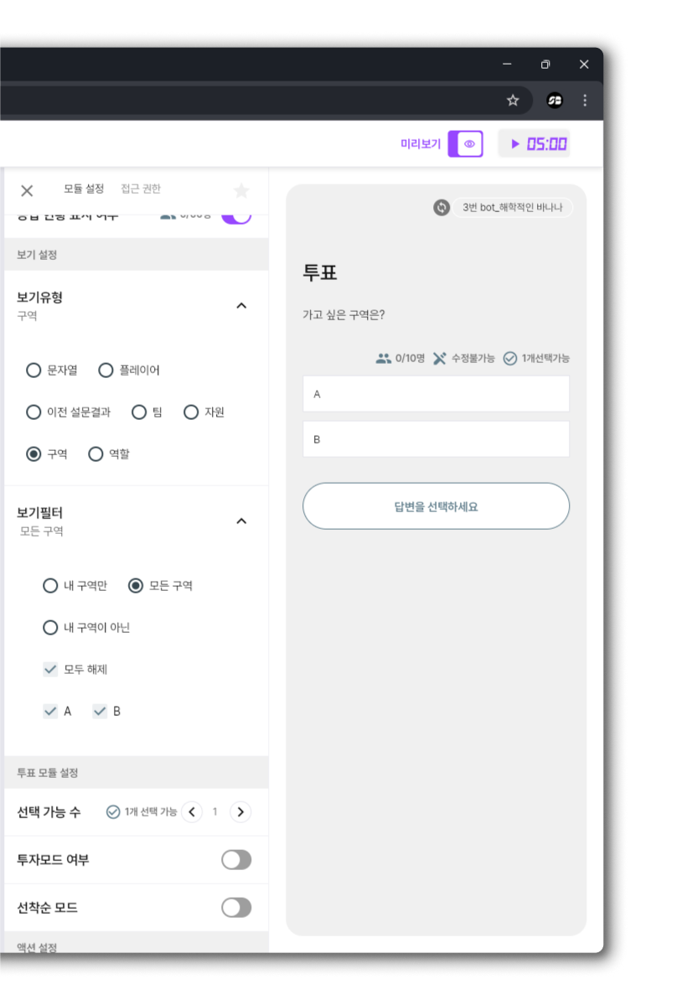
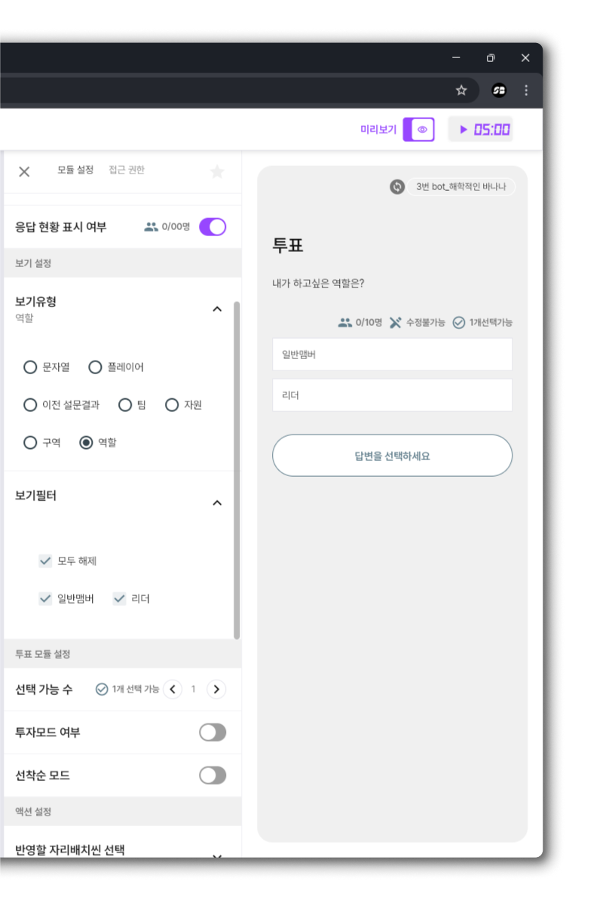

# 보기 유형

### 보기 유형 설명

<table><thead><tr><th width="147">유형</th><th>설명</th><th>예시</th></tr></thead><tbody><tr><td><strong>문자열</strong></td><td>선택지를 텍스트(문자열)로 표시합니다.</td><td>“예”, “아니오”, “모름” 등</td></tr><tr><td><strong>플레이어</strong></td><td>플레이어 닉네임을 선택지로 보여줍니다.</td><td>베스트 플레이어 투표</td></tr><tr><td><strong>이전 설문결과</strong></td><td>이전에 진행된 설문의 결과를 이용해 선택지를 자동 생성합니다.</td><td>“가장 좋았던 설문 결과” 고르기</td></tr><tr><td><strong>팀</strong></td><td>팀 단위로 선택지를 분류합니다.</td><td>“이동하고 싶은 팀” 투표</td></tr><tr><td><strong>구역</strong></td><td>구역(Zone) 단위로 선택지를 분류합니다.</td><td>“가고 싶은 구역” 투표</td></tr><tr><td><strong>자원</strong></td><td>특정 자원(포인트, 아이템 등)을 선택지로 구성합니다.</td><td>크라임씬 단서 투표</td></tr><tr><td><strong>역할</strong></td><td>플레이어 역할(관리자, 일반 멤버 등)을 선택지로 사용합니다.</td><td>“하고 싶은 역할 투표”<strong>팀</strong></td></tr></tbody></table>

### 보기 유형별 자세한 설명&#x20;




### 문자열 특징

1. **고정된 목록**
   * 미리 정해진 텍스트 옵션들을 플레이어가 선택할 수 있음
   * 예) "빨강", "파랑", "초록" 색상 투표
2. **복사 & 붙여넣기**
   * **\[보기 한번에 추가]** 기능을 활용하면, 여러 텍스트를 한 번에 등록 가능
   * 항목별로 개행(한 줄씩) 구분이 필수
3. **간단하고 직관적**
   * 어떤 속성(플레이어, 팀 등)과 연계되지 않고, 순수하게 텍스트 표시만 수행

<figure><figcaption></figcaption></figure>




### 플레이어 특징

1. **동적으로 관리되는 목록**
   * 실제 방에 입장한 플레이어들의 닉네임 정보를 자동으로 반영합니다.
   * 예) 플레이어가 새로 들어오거나 나가면, 목록도 그에 맞춰 변화.
2. **필터로 조건 제어 가능**
   * 팀, 구역, 성별, 역할 등 조건을 적용해, 특정 플레이어만 표시할 수 있습니다.
   * 예) 팀이 다른 사람만 보기, 남성만 보기 등.
3. **직접적인 인물 지목에 적합**
   * ‘MVP 투표’, ‘가장 대화가 재밌는 사람 뽑기’처럼 **특정 플레이어**를 직접 선택할 때 유용합니다.
4. **실시간 정보**
   * 플레이어의 상태(예: 변경된 닉네임, 역할 이동)가 즉시 반영되므로 **유연한 투표** 진행이 가능합니다.

<figure><figcaption></figcaption></figure>




### 이전 설문결과 특징

1. **과거 설문 데이터 재활용**
   * 이전에 진행했던 설문(또는 투표)의 응답 항목을 **자동으로** 불러와, 새로운 투표/설문에서 선택지로 활용할 수 있습니다.
   * 예) “1부 행사에서 받은 의견”을 2부에서 다시 투표에 부치는 경우.
2. **응답 항목 자동 등록**
   * 플레이어가 과거 설문에서 직접 입력한 텍스트나 선택지를 그대로 가져옵니다.
   * 불필요한 항목이나 중복된 항목을 필터로 제거할 수도 있습니다.
3. **단일 문항 연결**
   * 한 모듈에서는 **특정 이전 설문 문항** 한 개를 선택해 연결합니다.
   * 여러 문항을 동시에 합치는 것은 지원되지 않습니다.
4. **연속 의사결정에 적합**
   * \[설문 모듈]로 ‘가고 싶은 여행지’를 플레이어들이 자유롭게 작성
   * \[투표 모듈]에서 **이전 설문결과**를 가져와, “베스트 3”를 뽑는 인기 투표 진행
   * 플레이어들은 이전 단계에서 나온 실제 응답을 선택지로 보고, 최종 의사결정에 참여

<figure><figcaption></figcaption></figure>




### 팀 보기 특징

1. **팀 단위 표시**
   * 플레이어별 소속 팀 정보를 가져와, **팀을 선택지**로 구성합니다.
   * 예) “가장 협동을 잘한 팀에 투표” → 팀A, 팀B, 팀C가 보기로 자동 생성.
2. **팀 이름 또는 번호 기반**
   * 방이나 모듈 설정에서 미리 지정한 **팀1, 팀2** 등의 이름(혹은 번호)을 그대로 표시.
   * 팀명이 동적으로 바뀌면, 표시되는 이름도 같이 갱신됩니다.
3. **팀 필터(선택 사항)**
   * 특정 조건으로 “팀 = 1만 표시”, “팀 ≠ 내 팀”만 노출 등 상세 설정 가능.
   * 여러 팀 중 일부만 투표 대상에 넣거나, 자신이 속한 팀은 제외하는 등의 제한이 가능.

<figure><figcaption></figcaption></figure>




### 구역 보기 특징

1. **구역 단위 표시**
   * 방이나 모듈 설정에서 미리 정의된 A구역, B구역, C구역 등의 이름을 선택지로 자동 생성해줍니다.
   * 플레이어들이 활동 중인 구역을 **옵션**으로 노출하여, “어디로 이동하고 싶은지” 등을 투표할 수 있습니다.
2. **동적 연동 (환경에 따라)**
   * 플레이어가 구역을 이동하면, 해당 구역 정보가 반영되어 “구역 보기”가 달라질 수 있습니다.
   * 예) A구역에서 B구역으로 이동하면, 투표에 표시되는 구역이 달라질 수도 있음.
3. **구역 필터(선택 사항)**
   * “구역 = A만 보이기”, “구역 ≠ 본인 구역” 등 조건을 적용해 특정 구역만 표시하거나,
   * 자신이 속한 구역을 제외하고 다른 구역만 보이도록 설정할 수 있습니다.

<figure><figcaption></figcaption></figure>




### 자원 보기 특징

1. **자원 단위 표시**
   * 스코어보드에서 정의된 **포인트, 아이템** 등 다양한 자원을 **선택지**로 자동 생성합니다.
   * 플레이어들이 “어떤 자원을 선택할지” 혹은 “어떤 자원을 얻을지"를 투표로 결정할 때 사용할 수 있습니다.
2. **동적 연동 (환경에 따라)**
   * 자원(포인트, 아이템 등)의 보유 현황이 변경되면, 투표나 설문에서 표시되는 정보도 달라질 수 있습니다.
   * 예) 플레이어가 포인트를 획득/소비하면, 해당 자원의 상태가 실시간 반영되어 투표에 노출되는 자원 목록에 영향을 줄 수 있음.
3. **자원 필터(선택 사항)**
   * "내가 보유한 자원만" , "내가 보유하지 않은 자원만" 같은 자원 필터로 특정 자원만 보이도록 설정 할 수 있습니다.

<figure><figcaption></figcaption></figure>




### 역할 보기 특징

1. **역할 기반 표시**
   * 다른 보기 유형이 ‘플레이어’나 ‘팀’처럼 **구성원**을 노출하는 반면,\
     **역할 보기**는 **‘관리자’, ‘진행자’, ‘서브리더’, ‘일반 멤버’** 같은 사용자가 지정한역할명을 선택지로 보여줍니다.
   * 예: “다음 라운드 담당 역할을 뽑는다” → 후보 역할들을 보기로 노출해 플레이어가 투표.
2. **역할 우선도 조사**
   * “이번 팀 프로젝트에서 가장 시급한 역할은?” → ‘기획자’, ‘디자이너’, ‘발표자’ 등 여러 역할 항목 중 다수결로 결정.
3. **역할 배정**&#x20;
   * 투표 결과를 기반으로, 특정 플레이어에게 역할을 할당(**액션 버튼** 기능)

<figure><figcaption></figcaption></figure>



