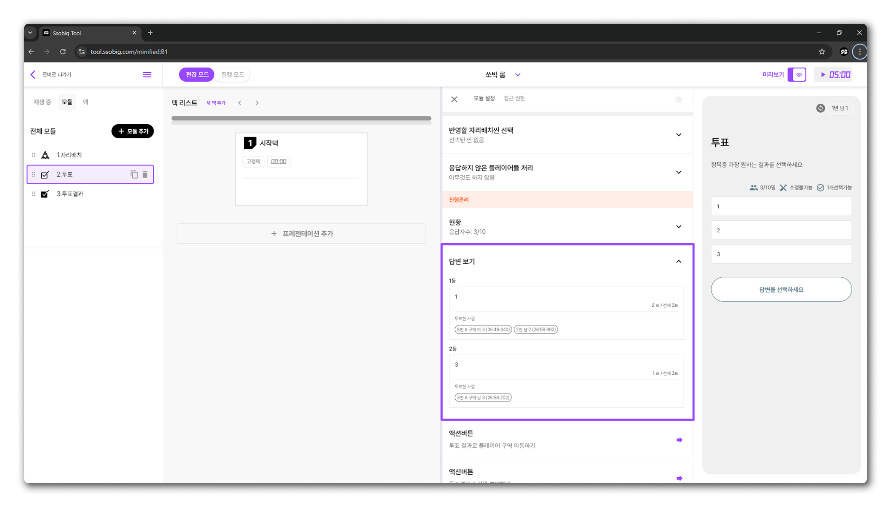

# 진행관리

## 현황

* 현재 어떤 플레이어가 응답을 제출했으며, 누가 응답하지 않았는지 한눈에 확인할 수 있습니다.
* 응답을 제출한 플레이어들의 응답을 삭제하거나 숨길 수 있습니다

<figure><figcaption></figcaption></figure>

## 답변보기

* 각 플레이어가 어떤 답변을 제출했는지 구체적으로 확인할 수 있습니다.

<figure><figcaption></figcaption></figure>

## 제출한 응답 초기화

* 모든 플레이어의 응답을 초기화하여, 새로운 투표를 진행할 수 있습니다.
* 한 번 응답이 초기화되면, 전 상태로 되돌릴 수 없으므로 주의하시기 바랍니다.

<figure><figcaption></figcaption></figure>

## 액션버튼

(준비중입니다.)

문의사항은 \[[지원받기](../../undefined-5/undefined-1.md)]

## 표시할 플레이어 정보

(준비중입니다.)

문의사항은 \[[지원받기](../../undefined-5/undefined-1.md)]

## 표시할 응답 목록

(준비중입니다.)

문의사항은 \[[지원받기](../../undefined-5/undefined-1.md)]

## 표시할 자원 목록

(준비중입니다.)

문의사항은 \[[지원받기](../../undefined-5/undefined-1.md)]

