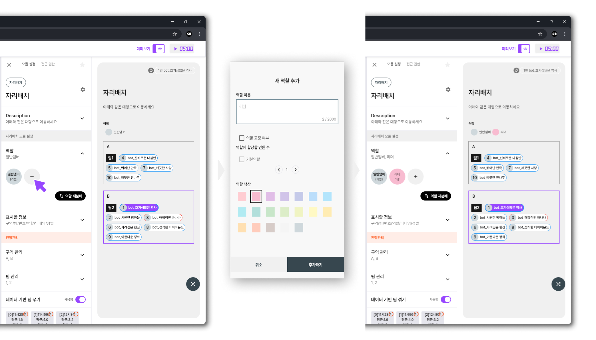

# Q1. 성별 없음으로 로그인 한 경우

### 일반 상황

* 일부 참가자분들이 **\[성별 없음]**&#xC73C;로 입장하시는 경우가 있습니다.
* 만약 **방 설정**에서 성별 입력을 필수 항목으로 지정해 두면, **\[성별 없음]** 으로 등록된 참가자분들은 입장이 제한될 수 있습니다.
  * 이 문제를 방지하려면, 방 설정에서 **플레이어 정보 수집 설정**을 확인하신 후, **성별 체크** 항목을 필수로 지정해 주세요.
  * **설정 경로:**\
    **방 설정 → 플레이어 정보 설정 → 플레이어 정보 수집 설정 → 성별 체크**

<figure><figcaption></figcaption></figure>

### 참자가 성별 변경 방법

* 이미 들어온 사람의 성별을 바꾸려면
  * **모듈** 메뉴에서 **자리 배치 모듈**을 클릭합니다.
  * **자리 배치 상세 설정** 화면에서, 성별을 변경할 **해당 플레이어의 닉네임**을 **롱 프레스(길게 누르기)** 합니다.

<figure><figcaption></figcaption></figure>

***
