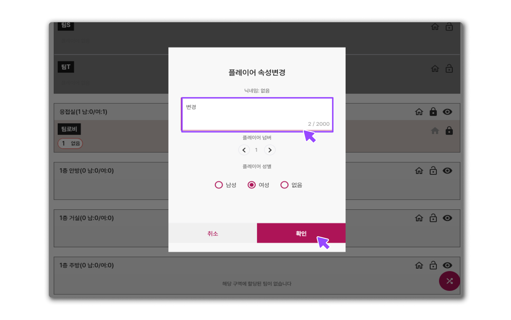

# Q2. 이름표랑 툴 닉네임이 달라요!

### 일반 상황

* 간혹 참가자들이 닉네임을 변경하거나 당일에 닉네임을 수정하는 경우가 있습니다.
* 만약 **방 설정**에서 참가자가 자유롭게 닉네임을 변경할 수 있도록 허용해두면,\
  참가자들이 필요에 따라 닉네임을 수정할 수 있습니다.
  * **설정 경로:**\
    **방 설정 → 플레이어 정보 설정 → 플레이어 정보 수집 설정 → 플레이어 본명 자체변경 허용** 옵션을 클릭하여 활성화할 수 있습니다.

<figure><figcaption></figcaption></figure>

### 참가자 닉네임 변경 방법

* 이미 들어온 사람의 닉네임을 바꾸려면
  * **모듈** 메뉴에서 **자리 배치 모듈**을 클릭합니다.
  * **자리 배치 상세 설정** 화면으로 이동한 후, 닉네임을 변경할 **해당 플레이어의 닉네임**을 **롱 프레스(길게 누르기)** 합니다.
  * 팝업 메뉴에서 **플레이어 닉네임 변경** 옵션을 선택하고, 원하는 닉네임으로 수정한 후 **확인 버튼**을 눌러 저장합니다.

<figure><figcaption></figcaption></figure>
