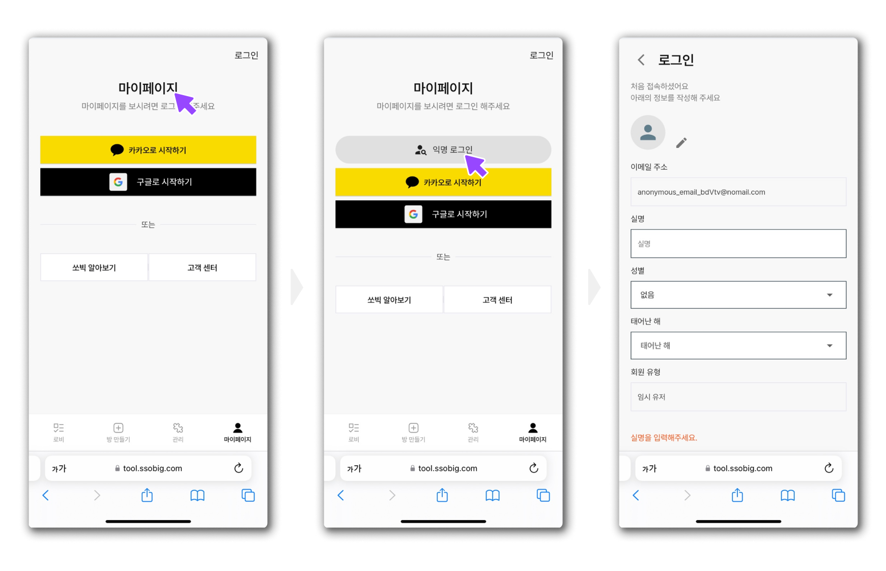

# Q2. 로그인이 안되는데 어떡하죠?

### 일반 상황

* 카카오 로그인이 안되는 경우 구글 로그인으로 접속해주세요.
* 아이폰의 경우 사파리 브라우저가 안되면 크롬 브라우저로 접속해주세요.

### 쿠키 차단이 된 경우 (안드로이드)

<figure><figcaption></figcaption></figure>

1. 크롬 오른쪽 점 3개 (설정창) 클릭합니다.
2. 설정을 클릭해 스크롤을 내려 고급에 사이트 설정을 클릭합니다.
3. 스크롤을 내려 기기 내 사이트 데이터 설정을 클릭합니다.
4. 기기 내 사이트 데이터 토글이 되어있는지 확인하세요.
   1. 토글이 안되어 있다면 켜서 다시 로그인을 시도 하세요.

<figure><figcaption></figcaption></figure>

### 쿠키 차단이 된 경우 (아이폰)

1. 아이폰 설정으로 들어가 Safari를 클릭합니다.
2. 아래로 스크롤 해서 모든 쿠키 차단이 되어있는지 확인
3. 차단이 켜져 있다면 끄고 다시 로그인을 시도해주세요.

<figure><figcaption></figcaption></figure>

## 해결 되지 않을 때 (익명로그인)

* 쏘빅 마이페이지를 5번 클릭하면 \[익명 로그인] 이 뜹니다.
* \[익명 로그인]을 클릭 후 로그인 해주세요.
* 익명 계정의 정보를 입력하여 접속해주세요.

<figure><figcaption></figcaption></figure>
